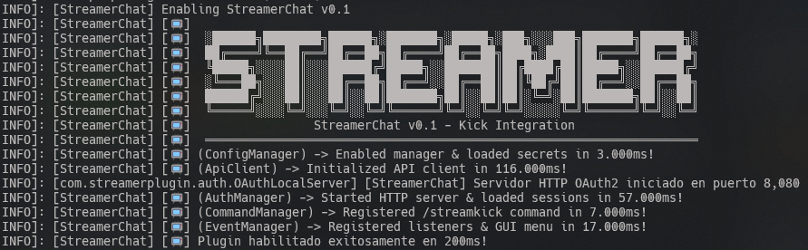
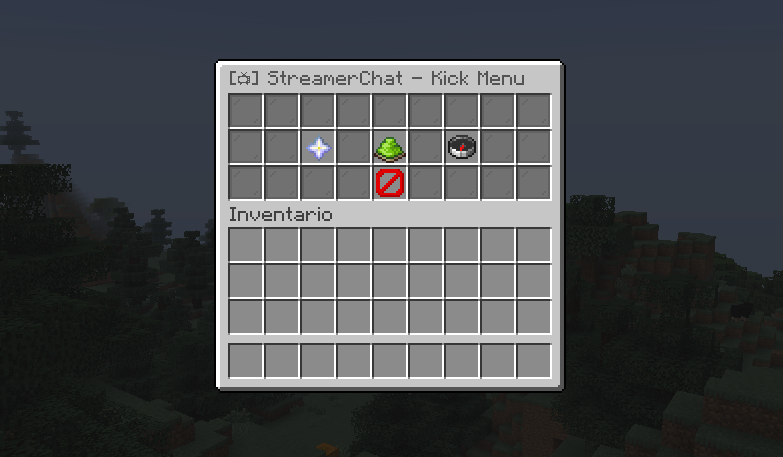
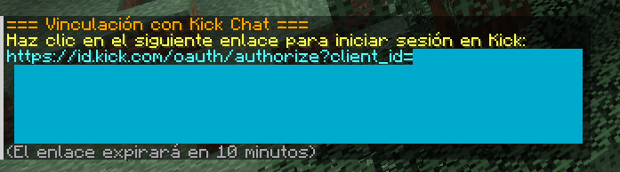
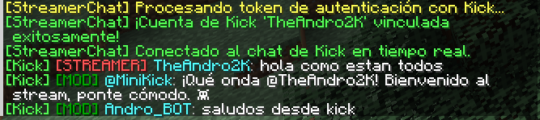

# 📺 StreamerChat - Plugin de Integración de Kick para Minecraft

[](https://papermc.io)
[](https://oracle.com/java)
[](https://dev.kick.com)
[](LICENSE)

**StreamerChat** es un plugin moderno y optimizado para servidores de Minecraft (Spigot/Paper/Purpur) que conecta en tiempo real los chats de los streamers de **Kick** directamente dentro del juego mediante **OAuth2 (PKCE)** y **WebSockets (Pusher)** multi-usuario.

---

## 📸 Capturas de Pantalla

| Consola & Inicio | Menú GUI Interactivo |
| :---: | :---: |
|  |  |

| Vinculación OAuth2 | Chat de Kick & Rangos en Minecraft |
| :---: | :---: |
|  |  |

---

## ✨ Características Principales

- **⚡ Inicio Estilizado en Consola**: Banner ASCII y medición en milisegundos de la carga de cada módulo.
- **🔐 Autenticación Segura Multi-Usuario (OAuth2 PKCE)**: Cada jugador/streamer vincula su propia cuenta de Kick mediante un servidor HTTP incrustado en el puerto 8080.
- **💬 WebSockets en Tiempo Real**: Conexión a la red de Pusher de Kick para recibir mensajes al instante sin impacto en los TPS del servidor.
- **📤 Envío de Mensajes a Kick (`/streamkick send <mensaje>`)**: Permite responder al chat de Kick directamente desde Minecraft consumiendo la API pública oficial.
- **🎨 Insignias / Rangos de Kick (`{badge}`)**: Identificación automática de rangos (`Broadcaster`, `Moderator`, `Subscriber`, `VIP`, `OG`) con prefijos personalizables en `config.yml`.
- **🚫 Filtro de Emotes**: Eliminación automática de etiquetas `[emote:ID:nombre]` para mantener la lectura limpia en pantalla.
- **📱 Menú GUI Interactivo en Juego (`/streamkick` o `/streamkick menu`)**: Interfaz gráfica de 27 ranuras con botones para cambiar el estado del chat, vincularse, consultar el estado o desvincularse.
- **🔒 Cero Secretos Expuestos**: Sistema de carga de `secrets.properties` y variables de entorno (`KICK_CLIENT_ID`, `KICK_CLIENT_SECRET`) para subir el repositorio a GitHub con total seguridad.

---

## 📁 Estructura de Capturas de Pantalla

Coloca las imágenes del plugin en la carpeta `docs/images/` respetando esta nomenclatura:

```text
docs/
└── images/
    ├── 01-console-startup-banner.png   # Banner ASCII y tiempos de carga en consola
    ├── 02-in-game-gui-menu.png         # Menú GUI interactivo (/streamkick menu)
    ├── 03-oauth2-kick-link.png         # Mensaje con enlace OAuth2 de Kick
    ├── 04-kick-chat-badges-in-mc.png   # Chat de Kick con rangos (STREAMER, MOD, SUB)
    └── 05-send-chat-command.png        # Comando /streamkick send enviando mensaje a Kick
```

---

## 🚀 Instalación y Configuración

### 1. Instalación Rápida (Plug-and-Play)
1. Descarga el archivo `.jar` compilado desde la sección de Releases.
2. Coloca el `.jar` en la carpeta `plugins/` de tu servidor de Minecraft.
3. Inicia o reinicia el servidor.
4. ¡Listo! Cualquier streamer puede usar `/streamkick auth` en el juego para vincular su chat.

### 2. Configuración para Desarrolladores (`secrets.properties`)
Si vas a alojar tu propio servidor o clonar el código desde GitHub:
1. Copia el archivo `src/main/resources/secrets.properties.example` a `plugins/StreamerChat/secrets.properties` (o `secrets.properties` en la raíz).
2. Ingresa tus credenciales obtenidas en [dev.kick.com](https://dev.kick.com):
   ```properties
   kick.client_id=TU_CLIENT_ID
   kick.client_secret=TU_CLIENT_SECRET
   ```
3. Alternativamente, puedes usar Variables de Entorno del Sistema:
   - `KICK_CLIENT_ID`
   - `KICK_CLIENT_SECRET`

---

## 🎮 Comandos y Permisos

| Comando | Descripción | Permiso |
| :--- | :--- | :--- |
| `/streamkick` o `/streamkick menu` | Abre la interfaz GUI interactiva | `streamerchat.user` |
| `/streamkick auth` | Inicia el proceso de vinculación con OAuth2 de Kick | `streamerchat.user` |
| `/streamkick send <mensaje>` | Envía un mensaje en vivo al chat de Kick | `streamerchat.user` |
| `/streamkick toggle` | Activa o desactiva la visibilidad del chat en pantalla | `streamerchat.user` |
| `/streamkick status` | Muestra el estado de la conexión y chatroom ID | `streamerchat.user` |
| `/streamkick disconnect` | Cierra la sesión y desvincula la cuenta | `streamerchat.user` |
| `/streamkick reload` | Recarga la configuración del plugin | `streamerchat.admin` |

*Alias soportados:* `/skick`, `/kick`.

---

## ⚙️ Configuración (`config.yml`)

```yaml
kick:
  client_id: ""
  client_secret: ""
  redirect_uri: "http://localhost:8080/auth/callback"
  auth_server_port: 8080
  scopes: "user:read chat:write"

chat:
  format: "&a[Kick] {badge} &b{user}&7: &f{message}"

badges:
  broadcaster: "&c[STREAMER]"
  moderator: "&2[MOD]"
  subscriber: "&d[SUB]"
  vip: "&5[VIP]"
  og: "&6[OG]"
  default: "&7[VIEWER]"
```

---

## 🛠️ Compilación desde el Código Fuente

Para compilar el proyecto tú mismo:

```bash
# Clonar el repositorio
git clone https://github.com/TU_USUARIO/streamerchat.git
cd streamerchat

# Compilar con Maven
mvn clean package
```

El ejecutable resultante estará en `target/streamerchat-0.1.jar`.

---

## 📄 Licencia

Este proyecto está bajo la Licencia [MIT](LICENSE).
